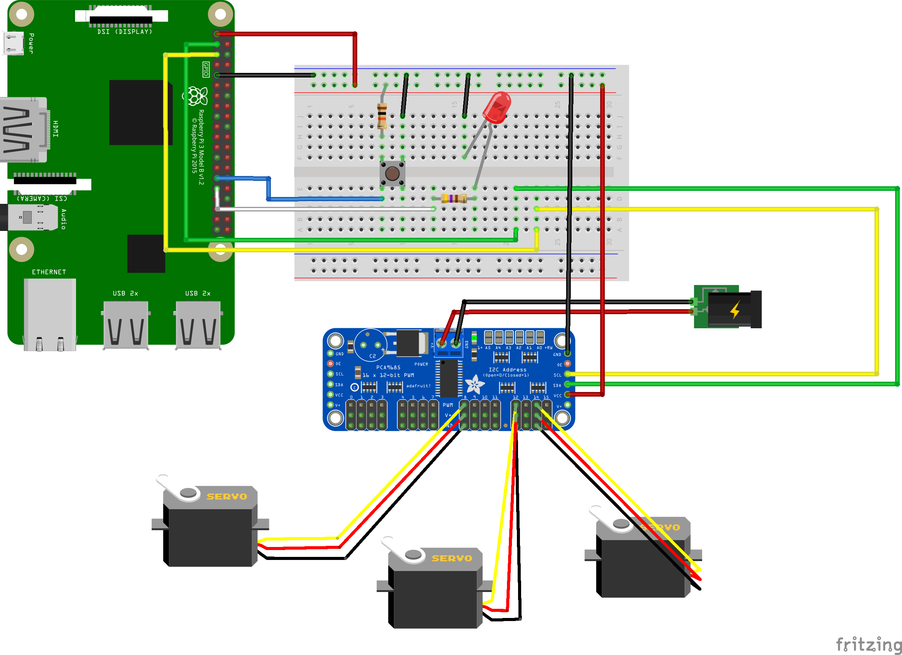

Hand Game robot with Kotlin/Native and Raspberry Pi
===================================================

Slide: https://speakerdeck.com/jinqian/bridge-the-physical-world-kotlin-native-on-raspberry-pi

## Test the project

### Circuit

This circuit schema represents what I use in my project:



Compile the project:

```
$ ./gradlew build
```

After a successful build you should be able to see that the binaries are generated under the `build/bin/chifumi` folder. In order to test the binary, deploy it on your Pi via SSH, make sure you update the SSH configuration, source folder and destination folder in `build.gradle` with your own configurations:

```
$ ./gradlew deployOnPi
```

If it's the first time you deploy on your Pi, you need to make sure your `.kexe` file is executable, then execute the binary with `sudo` to test with your circuit:

```
$ chmod 777 chifumi-robot.kexe
$ sudo ./chifumi-robot.kexe
```

> Note: you have to configure the [passwordless SSH access](https://www.raspberrypi.org/documentation/remote-access/ssh/passwordless.md) on your Pi to make the SSH plugin work.

## Other ideas

- Support `linuxArm64`?
- Desktop or other remote control

## Troubleshooting

### Error when deploying with SSH plugin

If you ran into this problem:

```
* What went wrong:
Execution failed for task ':deployOnPi'.
> com.jcraft.jsch.JSchException: invalid privatekey: [B@57eea633

```

That is caused by the private key headers generated by different versions of OpenSSH. You can refer to [this Stackoverflow post](https://stackoverflow.com/questions/53134212/invalid-privatekey-when-using-jsch) to solve the problem.

## Reference

- Building Multiplatform Projects with Gradle: https://kotlinlang.org/docs/reference/building-mpp-with-gradle.html
